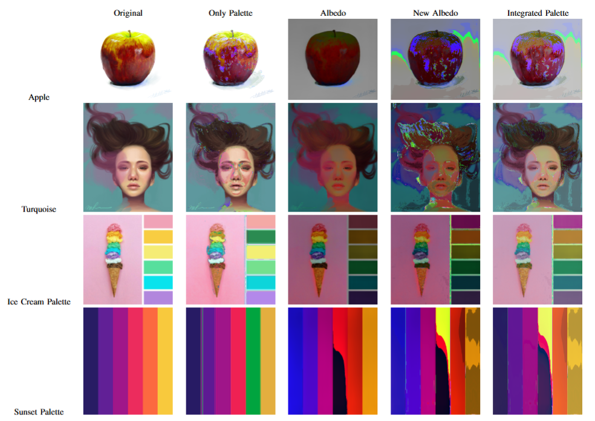
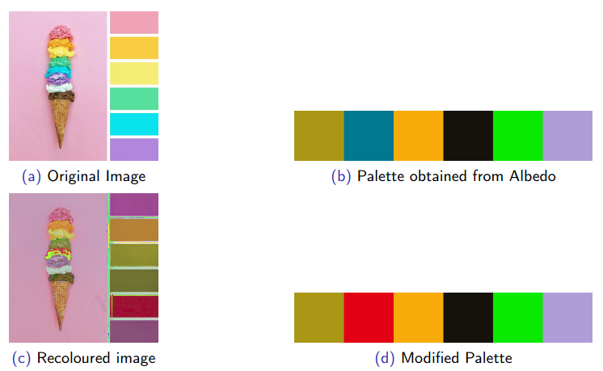
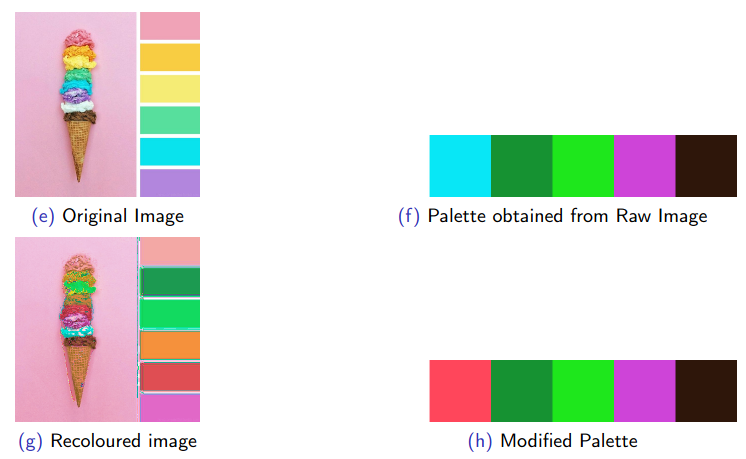

# Palette-Based-Recolouring

An image processing based project which allows the user to select an image and recolour it. It focuses on the use of a geometric approach to palette extraction for recolouring.

## Modules

### Palette Extraction

Paper references:  
- Wang, Yili, Yifan Liu, and Kun Xu. "An improved geometric approach for palette‐based image decomposition and recoloring." Computer Graphics Forum. Vol. 38. No. 7. 2019.
- Jianchao Tan, Jose Echevarria, and Yotam Gingold. 2018. Efficient palette-based decomposition and recoloring of images via RGBXY-space geometry. ACM Trans. Graph. 37, 6, Article 262 (December 2018)

This module builds a convex hull on the projection of the pixels of the image in RGB space as the initial palette. Then vertex wise adjusts this hull to improve representativeness of the palette by bringing it closer to point clusters while also minimizing the reconstruction loss.

### MVC Decomposition

This module uses Mean Value Coordinates to decompose the image by color after palette extraction. This method is then reversed after changing the palette as needed to reconstruct the image with new palette.

### Instrinsic shading

Paper references:
- Chris Careaga and Yağız Aksoy. 2023. Intrinsic Image Decomposition via Ordinal Shading. ACM Trans. Graph. 43, 1, Article 12 (February 2024)

This module uses a pre trained model (as provided by the implementation of the paper) to separate the image into a light independent albedo and the diffused shading. One can use this module to choose between applying recolouring only on the albedo before reconstructing or applying recolouring to the original image itself.

## Usage
Once you have cloned the repository, there are two options for applying the recolouring on an image of your choice

- Recolouring on original image  
`only_pal.sh <path to input image>`
- Intrinsic decomposition, followed by recolouring on the albedo, and then reconstruction  
`int_and_pal.sh <path to input image>`

An output folder is created in both, to showcase the results. For changing the palette, one can access it as `refined_palette.obj` in the folder created.

## Results of testing

### Both types of reconstruction on different test images

### Recolouring with Intrinsic Decomposition

### Recolouring without Intrinsic Decomposition
